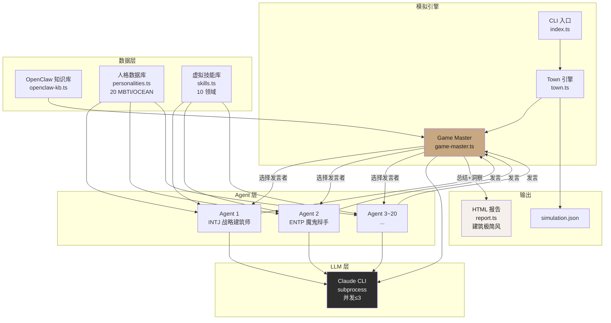
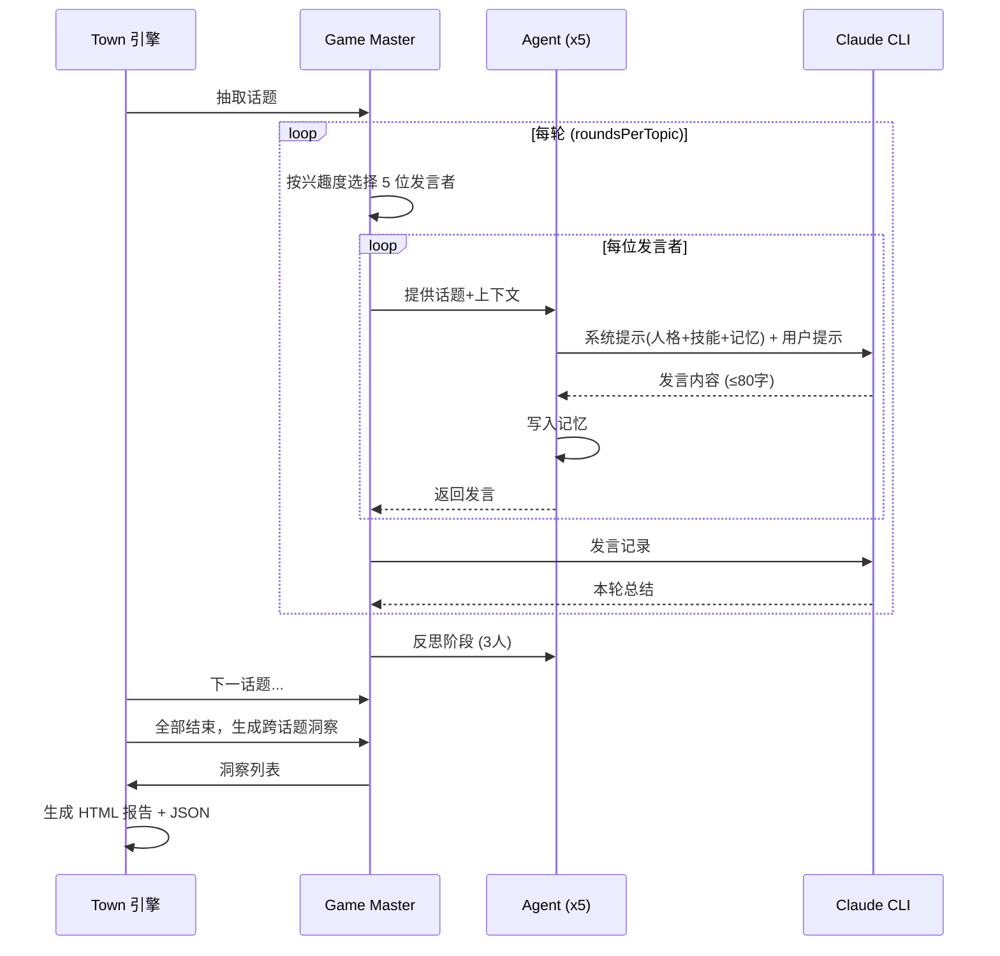
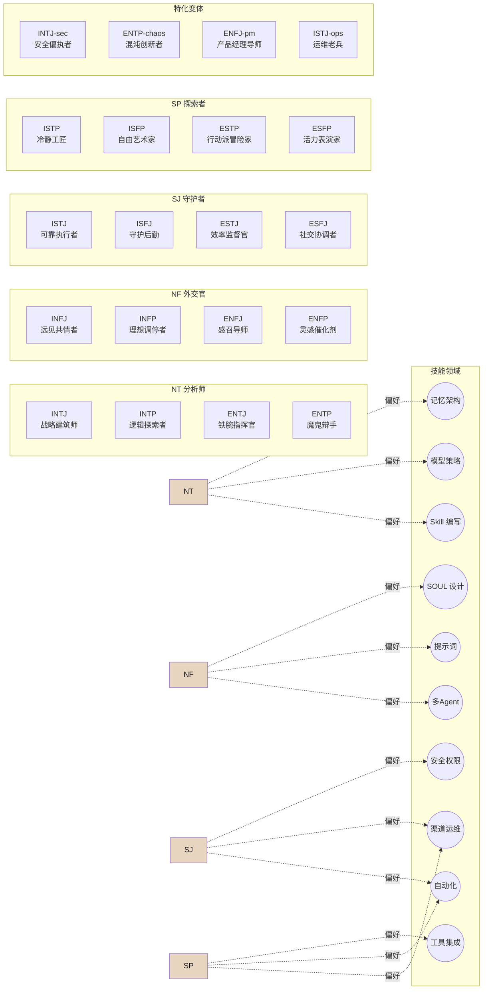

# mem-mem — OpenClaw 讨论小镇

> 20 位拥有不同 MBTI 人格和虚拟技能的 AI Agent，在 Game Master 的引导下围绕 OpenClaw 核心议题展开多轮讨论。纯文本，零前端依赖，一行命令启动。

## 为什么做这个

搭建多 Agent 系统时，最难的不是代码，而是理解 **Agent 之间如何沟通**。

- 不同人格的 Agent 对同一话题的反应差异有多大？
- INTJ 和 ENFP 在讨论"安全 vs 效率"时会产生什么碰撞？
- 什么样的人格组合能产出最有深度的讨论？

mem-mem 用一个可观察的沙箱回答这些问题。你可以调整人格、话题、模型，然后观察 Agent 的行为模式。

## 架构

### 系统拓扑



### 讨论流程



### 人格-技能分配拓扑



**核心设计决策：**

- **Concordia GM 中介模式** — Agent 不直接通信，全部通过 GM 中转，便于观察和记录
- **MBTI + OCEAN 双维人格** — 16 种标准 MBTI 类型 + 4 个特化变体（安全偏执者、混沌创新者等）
- **轮次制讨论** — 每轮 GM 选人→Agent 发言→GM 总结，结构清晰可回放
- **沙箱隔离** — 不读写外部数据，所有知识库自包含

## 快速开始

```bash
# 安装
git clone https://github.com/nieao/mem-mem.git
cd mem-mem
bun install

# Mock 模式（不消耗 API，3 秒跑完，用于验证流程）
bun run src/index.ts --mock

# 真实 LLM 模式（默认 Haiku，约 13 分钟）
bun run src/index.ts

# 自定义参数
bun run src/index.ts --topics 3 --rounds 2 --speakers 5

# 用 Sonnet 获得更好的人格区分度
bun run src/index.ts --model claude-sonnet-4-6
```

运行结束后打开 `reports/report.html` 查看可视化报告。

## 参数

| 参数 | 默认值 | 说明 |
|------|--------|------|
| `--mock` | false | Mock 模式，不调用 LLM |
| `--topics N` | 4 | 讨论话题数（最多 8） |
| `--rounds N` | 2 | 每话题讨论轮数 |
| `--speakers N` | 5 | 每轮发言人数 |
| `--agents N` | 20 | 居民总数（最大 20） |
| `--model NAME` | claude-haiku-4-5-20251001 | LLM 模型 |
| `--output DIR` | ./reports | 报告输出目录 |

## 20 位居民

每位居民拥有 MBTI 人格、OCEAN 五维特质分数、独特的沟通和决策风格，以及 2-3 个 OpenClaw 相关虚拟技能。

| 人格 | 原型 | 沟通特点 |
|------|------|---------|
| INTJ | 战略建筑师 | 简洁直接，直达本质 |
| INTP | 逻辑探索者 | 思维跳跃，爱假设 |
| ENTJ | 铁腕指挥官 | 结论先行，目标导向 |
| ENTP | 魔鬼辩手 | 挑衅提问，反直觉 |
| INFJ | 远见共情者 | 温和深刻，善用隐喻 |
| INFP | 理想调停者 | 感性表达，寻求和解 |
| ENFJ | 感召导师 | 鼓励整合，推动共识 |
| ENFP | 灵感催化剂 | 热情联想，灵感连接 |
| ISTJ | 可靠执行者 | 事实导向，精确引用 |
| ISFJ | 守护后勤 | 温暖贴心，关注细节 |
| ESTJ | 效率监督官 | 条理清晰，命令式 |
| ESFJ | 社交协调者 | 热情友好，善于倾听 |
| ISTP | 冷静工匠 | 惜字如金，实验驱动 |
| ISFP | 自由艺术家 | 柔和含蓄，重视体验 |
| ESTP | 行动派冒险家 | 直爽豪迈，先做再说 |
| ESFP | 活力表演家 | 生动有趣，爱讲故事 |
| INTJ-sec | 安全偏执者 | 警告式语气，最坏情况 |
| ENTP-chaos | 混沌创新者 | 颠覆一切，反共识 |
| ENFJ-pm | 产品经理型导师 | 结构化引导，用户优先 |
| ISTJ-ops | 运维老兵 | 极度保守，要回滚方案 |

## 讨论话题

8 个 OpenClaw 核心议题，每次随机抽取：

- SOUL.md 的灵魂拷问：如何设计一个有"人味"的 Agent？
- 记忆的战争：Agent 应该记住什么，忘记什么？
- 安全偏执狂 vs 效率至上：权限边界在哪里？
- 模型经济学：Haiku 够用还是必须 Opus？
- Skill 生态：Agent 的"超能力"怎么设计？
- 多 Agent 混战：协作还是灾难？
- 自动化边界：Agent 应该多"自主"？
- 渠道战略：Telegram 之外还有什么？

## 技术栈

- **运行时**：Bun（原生 TypeScript 执行）
- **LLM**：本地 claude CLI subprocess（零 API Key 配置）
- **报告**：单文件 HTML，建筑极简唯美风格
- **架构参考**：[Concordia](https://github.com/google-deepmind/concordia)（GM 中介模式）、[Generative Agents](https://github.com/joonspk-research/generative_agents)（记忆系统）、[hanzoai/personas](https://github.com/hanzoai/personas)（OCEAN 人格体系）

## 项目结构

```
src/
├── index.ts           CLI 入口
├── types.ts           核心类型定义
├── llm.ts             Claude CLI 调用层（并发控制+超时保护）
├── personalities.ts   20 个 MBTI/OCEAN 人格档案
├── skills.ts          10 个 OpenClaw 虚拟技能
├── agent.ts           Agent 实体（人格+技能+记忆）
├── game-master.ts     GM 中介（选人·总结·洞察）
├── openclaw-kb.ts     OpenClaw 知识库（沙箱内自包含）
├── town.ts            小镇模拟引擎
└── report.ts          HTML 报告生成器
```

## 已知局限

- **人格区分度受模型能力限制** — Haiku 的角色扮演能力有限，部分 Agent 风格趋同。用 Sonnet 效果更好。
- **讨论倾向共识** — Agent 更多是"同意+补充"，较少出现尖锐对立。可在系统提示中调整。
- **记忆跨话题影响有限** — 当前记忆主要用于同话题内的上下文延续。

## License

MIT
